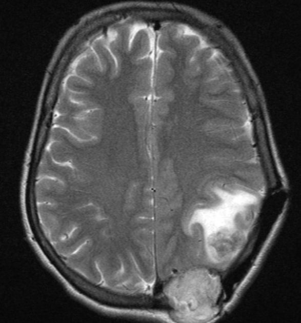

# Tumour Detection System Using U-Net

## Description

This project implements a tumour detection system using a U-Net architecture, a powerful convolutional neural network designed for biomedical image segmentation. The system processes medical images (e.g., MRI, CT scans) to accurately segment and highlight tumour regions, aiding in diagnosis and treatment planning. The U-Net model excels at learning spatial hierarchies and local patterns critical for identifying tumours.

The project includes preprocessing, model training, evaluation, and deployment of the tumour detection pipeline, making it an end-to-end solution for medical image segmentation tasks.

# Sample Segmentation and Prediction



## Technologies Used

**Python:**  
The core programming language used for implementing the project.  

**TensorFlow & Keras:**  
Frameworks for building and training the U-Net model. They provide flexible APIs for deep learning.  

**OpenCV:**  
For image preprocessing, including resizing, normalization, and augmentation.  

**Scikit-learn:**  
For evaluation metrics like precision, recall, F1 score, and AUC.  

**Pillow (PIL):**  
For loading and saving image data.  

## Prerequisites

**Python 3.8+:**  
Ensure you have Python installed.  

**Virtual Environment:**  
Create a virtual environment to avoid dependency conflicts.  

**Dependency List:**  
Install required packages from the `requirements.txt` file using the following command:  
```bash
pip install -r requirements.txt
```

## Installation Guide

### 1. Clone the Repository  
```bash
git clone https://github.com/yourusername/Tumour-Detection-System
```

### 2. Navigate to the Project Directory  
```bash
cd /path/to/your/downloaded/repo
```

### 3. Set Up the Virtual Environment  
```bash
python -m venv env
source env/bin/activate  # On Windows: env\Scripts\activate
```

### 4. Install Dependencies  
```bash
pip install -r requirements.txt
```

### 5. Prepare the Dataset  
Place your dataset in the `data/` directory. Ensure that the dataset follows the structure:  
```
data/
├── train/
│   ├── images/
│   ├── masks/
├── val/
│   ├── images/
│   ├── masks/
```

## Disclaimer

This project is for research and educational purposes only. It is not intended for use in clinical diagnosis without further validation and regulatory approvals. Always ensure compliance with medical data privacy regulations when handling patient data.

***
